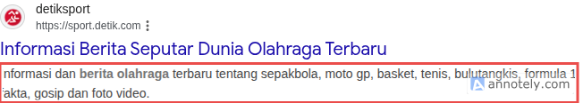
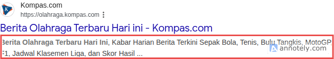
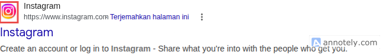
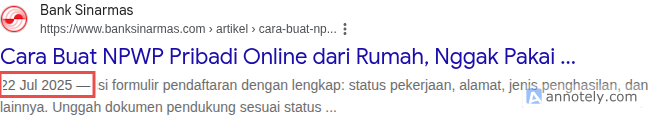

## Apa Itu Search Google Search Result?

Google search result adalah tampilan halaman website di hasil pencarian google.

## Apa Saja yang Ditampilkan di Google Search Result?

Ada beberapa informasi terkait halaman website yang ditampilkan di google search result, di antaranya:

- Nama website
- Alamat URL
- Judul
- Deskripsi
- Favicon/Logo website
- Tanggal publish

Berikut detail penjelasan masing-masing informasi halaman website pada google search result:

### Nama Website


Nama website adalah nama website dari halaman yang ditampilkan, misalnya Detik, Wikipedia, Youtube, dsb.

Nama website biasanya secara otomatis diambil dari judul, nama di opengraph, dan teks-teks lain di halaman beranda website.

```html
<!-- Bisa dari judul -->
<title>My Website</title>

<!-- Bisa dari nama di opengraph -->
<meta name="og:site_name" value="My Website" />

<!-- Atau teks lain -->
<h1>My Website</h1>
```

Nama website juga bisa ditentukan sendiri melalui struktur data yang dibuat oleh pemilik website.

```html
<html>
  <head>
    <script type="application/ld+json">
      {
        "@context": "https://schema.org",
        "@type": "WebSite",
        "name": "My Website",
        "alternateName": "EC",
        "url": "https://website.my.id/"
      }
    </script>
  </head>
  <body></body>
</html>
```

### Alamat URL


Alamat URL halaman website juga ditampilkan di google search result.

Apabila URL nya berada di dalam path, misal (`https://id.wikipedia.org/wiki/Cristiano_Ronaldo`) maka google biasanya akan menampilkan URL tersebut dalam bentuk breadcrumb (`https://id.wikipedia.org > wiki > Cristiano_Ronaldo`).


Breadcrumb adalah URL yang dipecah jadi beberapa path, setiap path dipisah dengan tanda `>`. Sehingga bentuk URL menjadi seperti hirerarki navigasi per path.

Breadcrumb hanya muncul di device desktop.

Breadcrumb juga bisa dibuat sendiri, yaitu dengan struktur data. Contoh:

```html
<html>
  <head>
    <title>Top 10 Striker Terbaik Sepanjang Masa</title>
    <script type="application/ld+json">
      {
        "@context": "https://schema.org",
        "@type": "BreadcrumbList",
        "itemListElement": [
          {
            "@type": "ListItem",
            "position": 1,
            "name": "Sepakbola",
            "item": "https://sport.com/sepakbola"
          },
          {
            "@type": "ListItem",
            "position": 2,
            "name": "Statistik",
            "item": "https://sport.com/sepakbola/statistik"
          },
          {
            "@type": "ListItem",
            "position": 3,
            "name": "Top 10 Striker Terbaik Sepanjang Masa"
          }
        ]
      }
    </script>
  </head>
  <body></body>
</html>
```

Hasilnya: `https://sport.com > Sepakbola > Statistik > Top 10 Striker Terbaik Sepanjang Masa`.

### Judul


Judul halaman website umumnya diambil dari meta tag `<title>` atau bisa juga dari tag `<h1>`, meta `og:title`, dll.

```html
<!-- Bisa dari title -->
<title>Cara Membuat Roti Bakar</title>

<!-- Bisa dari nama di opengraph -->
<meta name="og:title" value="Cara Membuat Roti Bakar" />

<!-- Bisa dari h1 -->
<h1>Cara Membuat Roti Bakar</h1>
```

Jika judul terlalu panjang maka akan terpotong.


Tidak ada ketentuan pasti berapa maksimal karakter pada judul. Yang direkomendasikan adalah 60 karakter atau 575px.

### Deskripsi



Deskripsi halaman website umumnya diambil dari meta tag `<meta name="description" />`. Kadang Google juga membuat deskripsi sendiri berdasarkan konten yang ada di halaman website.

Jika deskripsi terlalu panjang maka akan terpotong.



Tidak ada ketentuan pasti berapa maksimal karakter pada deskripsi. Yang direkomendasikan adalah 155 karakter.

Beberapa kata di deksripsi yang cocok dengan pencarian pengguna akan ditebalkan.

### Favicon/Logo



Logo yang ditampilkan pada google search result sama dengan favicon pada website. Yaitu yang terdapat di tag `<link ref="favicon" />`.

### Tanggal Publish



Apabila di halaman website terdapat tanggal publish, maka tanggal tersebut akan ditampilkan sebelum teks deskripsi.

Tanggal publish diambil dari tanggal yang di halaman tersebut atau pemilik website bisa juga menentukan tanggalnya di struktur data.

```html
<!-- Tanggal publish dari teks -->
<p>Diposting tanggal 20 Juni 2026</p>

<!-- Tanggal publish dari struktur data -->
<html>
  <head>
    <title>Cara Membuat NPWP Online</title>
    <script type="application/ld+json">
      {
        "@context": "https://schema.org",
        "@type": "NewsArticle",
        "headline": "Cara Membuat NPWP Online",
        "datePublished": "2026-07-20T08:00:00+08:00",
        "dateModified": "2026-07-20T09:20:00+08:00"
      }
    </script>
  </head>
  <body></body>
</html>
```

## Tips Membuat Halaman Website Yang Tampil Baik di Google Search Result

1. Pastikan halaman website memiliki logo/favicon.
2. Judul direkomendasikan tidak lebih dari 60 karakter atau 575px.
3. Deskripsi direkomendasikan tidak lebih dari 155 karakter.
4. Pastikan halaman beranda website tersedia dan dapat diakses agar nama website dapat muncul.
