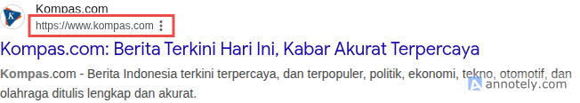
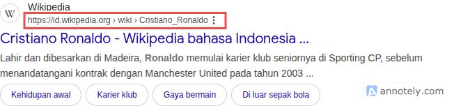
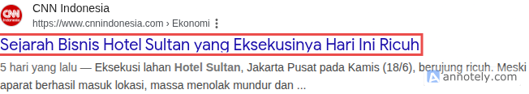
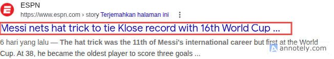

## Apa Itu Search Google Search Result?

Google search result adalah tampilan halaman website di hasil pencarian google.

## Apa Saja yang Ditampilkan di Google Search Result?

Ada beberapa informasi terkait halaman website yang ditampilkan di google search result, di antaranya:

- Nama website
- Alamat URL
- Judul
- Deskripsi
- Favicon/Logo website
- Kata kunci
- Tanggal publish

Berikut detail penjelasan masing-masing informasi halaman website pada google search result:

### Nama Website


Nama website adalah nama website dari halaman yang ditampilkan, misalnya Detik, Wikipedia, Youtube, dsb.

Nama website biasanya secara otomatis diambil dari judul, nama di opengraph, dan teks-teks lain di halaman beranda website.

```html
<!-- Bisa dari judul -->
<title>My Website</title>

<!-- Bisa dari nama di opengraph -->
<meta name="og:site_name" value="My Website" />

<!-- Atau teks lain -->
<h1>My Website</h1>
```

Nama website juga bisa ditentukan sendiri melalui struktur data yang dibuat oleh pemilik website.

```html
<html>
  <head>
    <script type="application/ld+json">
      {
        "@context": "https://schema.org",
        "@type": "WebSite",
        "name": "My Website",
        "alternateName": "EC",
        "url": "https://website.my.id/"
      }
    </script>
  </head>
  <body></body>
</html>
```

### Alamat URL

Alamat URL halaman website juga ditampilkan di google search result.



Apabila URL nya berada di dalam path, misal (`https://id.wikipedia.org/wiki/Cristiano_Ronaldo`) maka google biasanya akan menampilkan URL tersebut dalam bentuk breadcrumb (`https://id.wikipedia.org > wiki > Cristiano_Ronaldo`).



Breadcrumb adalah URL yang dipecah jadi beberapa path, setiap path dipisah dengan tanda `>`. Sehingga bentuk URL menjadi seperti hirerarki navigasi per path.

Breadcrumb hanya muncul di device desktop.

Breadcrumb juga bisa dibuat sendiri, yaitu dengan struktur data. Contoh:

```html
<html>
  <head>
    <title>Top 10 Striker Terbaik Sepanjang Masa</title>
    <script type="application/ld+json">
      {
        "@context": "https://schema.org",
        "@type": "BreadcrumbList",
        "itemListElement": [
          {
            "@type": "ListItem",
            "position": 1,
            "name": "Sepakbola",
            "item": "https://sport.com/sepakbola"
          },
          {
            "@type": "ListItem",
            "position": 2,
            "name": "Statistik",
            "item": "https://sport.com/sepakbola/statistik"
          },
          {
            "@type": "ListItem",
            "position": 3,
            "name": "Top 10 Striker Terbaik Sepanjang Masa"
          }
        ]
      }
    </script>
  </head>
  <body></body>
</html>
```

Hasilnya: `https://sport.com > Sepakbola > Statistik > Top 10 Striker Terbaik Sepanjang Masa`.

### Judul

Judul halaman website umumnya diambil dari meta tag `<title>` atau bisa juga dari tag `<h1>`, meta `og:title`, dll.



Jika judul terlalu panjang maka akan terpotong.



Tidak ada ketentuan pasti berapa maksimal karakter pada judul. Namun yang direkomendasikan adalah 60 karakter atau 575px.

### Deskripsi Halaman Website

Deskripsi halaman website diambil dari meta tag `<meta name="description" />`. Kadang google juga membuat deskripsi sendiri berdasarkan konten yang ada di halaman website.

Minimal karakter pada deskripsi halaman website adalah 50 karakter.

Maksimal karakter pada deskripsi halaman website adalah 155 karakter atau 575 piksel. Jika deskripsi lebih dari itu, maka deskripsi akan dipotong.

### Favicon/Logo Halaman Website

Logo yang ditampilkan pada google search result sama dengan yang ditampilkan di website dari tag `<link ref="favicon" />`.

### Tanggal Publish Halaman Website

Halaman website yang memiliki tanggal publish biasanya akan muncul tanggal tersebut sebelum deskripsi halaman.

Tanggal publish diambil dari tanggal yang pada halaman tersebut atau pemilik website bisa juga menentukan tanggalnya di struktur data.
